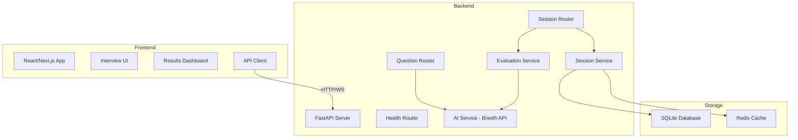

# 🏗️ ARCHITECTURE.md — AI Interview Agent

> System architecture and design specifications.

---

## System Overview

The AI Interview Agent is a full-stack application that conducts mock technical interviews powered by AI. It generates contextual questions based on the user's target role/domain, evaluates their answers in real-time, and provides detailed feedback with scoring.

---

## Architecture

---

## Data Models

### InterviewSession
| Field | Type | Description |
|-------|------|-------------|
| id | UUID | Unique session identifier |
| role | string | Target job role |
| domain | string | Interview domain |
| difficulty | enum | easy/medium/hard |
| status | enum | pending/active/completed |
| created_at | datetime | Session creation time |

### Question
| Field | Type | Description |
|-------|------|-------------|
| id | UUID | Unique question identifier |
| session_id | UUID | FK to InterviewSession |
| text | string | Question content |
| category | string | Question category |
| difficulty | enum | easy/medium/hard |
| order | int | Display order |

### Answer
| Field | Type | Description |
|-------|------|-------------|
| id | UUID | Unique answer identifier |
| question_id | UUID | FK to Question |
| answer_text | string | User's response |
| score | float | AI-evaluated score (0-100) |
| feedback | string | AI-generated feedback |
| evaluated_at | datetime | Evaluation timestamp |

---

## Technology Decisions

| Decision | Choice | Rationale |
|----------|--------|-----------|
| Backend Framework | FastAPI | Async support, auto-docs, type safety |
| AI Provider | Breeth API | Hackathon-provided API key |
| Database (Dev) | SQLite | Zero config, portable |
| ORM | SQLAlchemy + SQLModel | FastAPI integration, type safety |
| Testing | pytest + httpx | Async test support |
| API Format | REST JSON | Simple, well-understood |

---
