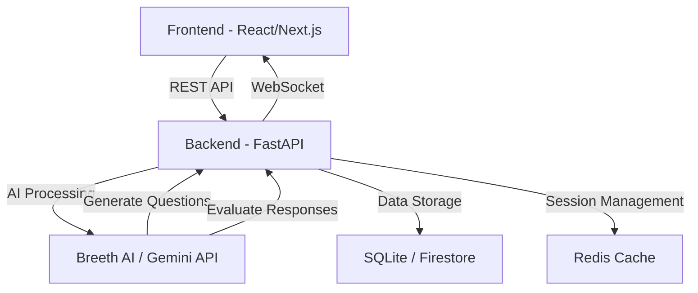

# 📊 PROJECT STATE — AI Interview Agent

> **Last Updated:** 2026-08-07
> **Status:** Active Development
> **Branch:** `master`

---

## 🏗️ Architecture Diagram

### System Flow
1. **User** selects role/domain for interview practice
2. **Backend** generates contextual questions via AI (Breeth API)
3. **Frontend** presents questions with timer and recording
4. **Backend** evaluates answers, provides scores and feedback
5. **Results** are stored and displayed as performance analytics

---

## 📡 API Contracts

### Base URL: http://localhost:8000

| Method | Endpoint | Request Body | Response Schema | Status |
|--------|----------|--------------|-----------------|--------|
| POST | `/api/v1/sessions` | `{ role, domain, difficulty }` | `{ session_id, questions[] }` | 🟡 Planned |
| GET | `/api/v1/sessions/{id}` | - | `{ session, questions, status }` | 🟡 Planned |
| POST | `/api/v1/sessions/{id}/answer` | `{ question_id, answer_text }` | `{ evaluation, score, feedback }` | 🟡 Planned |
| GET | `/api/v1/sessions/{id}/results` | - | `{ overall_score, breakdown[] }` | 🟡 Planned |
| POST | `/api/v1/questions/generate` | `{ role, domain, count }` | `{ questions[] }` | 🟡 Planned |
| GET | `/api/v1/health` | - | `{ status, version }` | 🟡 Planned |

---

## 📁 Key Files Reference

### Backend (FastAPI)
- `backend/main.py` — FastAPI application entry point
- `backend/routers/` — API route handlers
- `backend/models/` — Pydantic schemas and DB models
- `backend/services/` — Business logic (AI integration, evaluation)
- `backend/core/config.py` — Configuration and environment variables

### Frontend (React/Next.js)
- `frontend/src/` — React components and pages
- `frontend/src/api/` — API client functions

---

## 🔑 Technical Key Decisions

- **AI Provider:** Breeth API (API Key: provided) for question generation and answer evaluation
- **Backend Framework:** FastAPI with async endpoints
- **Database:** SQLite for development, Firestore for production
- **Authentication:** Session-based for MVP
- **Real-time:** WebSocket for live interview experience
